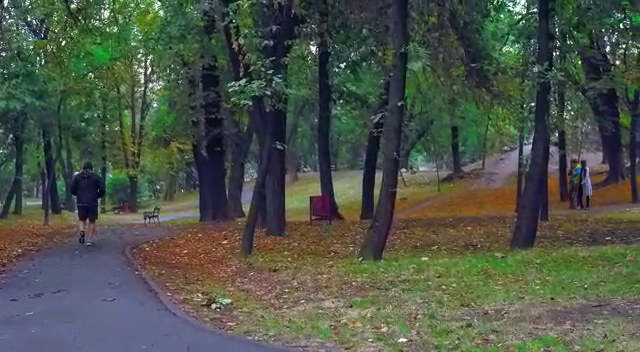
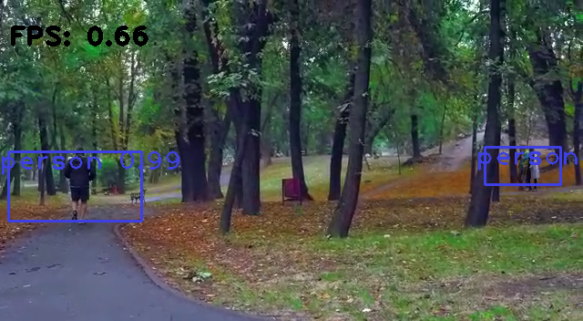

# YOLOv3 Human Detection Program   

There is an object detection algorithm called YOLO (You Only Live Once). In this case, the entire image is processed by a single neural network. Image regions are divided up by this network. It then forecast boxes and probabilities for each region. A probability distribution is applied to these bounding boxes in order to determine their weighting.

- Firstly, we import the essential libraries.

    ```python
    import cv2 #for image processing
    import numpy as np #for numeric calculations
    # from google.colab.patches import cv2_imshow
    ```

- Then, we import the datasets. Download the full dataset archive from [here](https://www.kaggle.com/valentynsichkar/yolo-coco-data). Also, we store the final or output layer of the architecture because we are concerned with the outputs.

    ```python
    net = cv2.dnn.readNet("yolov3.weights", "yolov3.cfg")
    layer_names = net.getLayerNames()
    output_layers = [layer_names[i[0] - 1] for i in net.getUnconnectedOutLayers()]
    with open("coco.names", "r") as f: classes = [line.strip() for line in f.readlines()]
    colors = np.random.uniform(0, 255, size=(len(classes), 3))
    ```

- Now, provide an input video file. This project's sample video can be downloaded from [here](https://github.com/suvrashaw/YOLO-Flask/raw/prime/templates/sample.mp4).

    ```python
    cap = cv2.VideoCapture("sample.mp4")
    ```

    


- Set the label font for YOLO detction.

    ```python
    font = cv2.FONT_HERSHEY_PLAIN
    ```

- Set the time, using the time library.

    ```python
    import time
    starting_time = time.time()
    ```

- Set the output file configurations.

    ```python
    result = cv2.VideoWriter('output.mp4', cv2.VideoWriter_fourcc(*'MJPG'),25, (640, 352))
    ```

- The loop starts to ork on the input video, frame by frame.

    ```python
    frame_id = 0
    while True: #infinite loop
        _, frame = cap.read() #reading frame by frame
        frame_id += 1 #interator to calculate the frames
        height, width, channels = frame.shape #configuration of each frame
        blob = cv2.dnn.blobFromImage(frame, 0.00392, (416, 416), (0, 0, 0), True, crop=False) #416x416 resizing + channel reorder
        net.setInput(blob) #fed to YOLO network
        outs = net.forward(output_layers) #output from YOLO network, detected images
        class_ids = [] #coco.name object
        confidences = [] #detection accuracy
        boxes = [] #boxes around a person
        for out in outs: #object detection
            for detection in out: #detection = outs[i]
                scores = detection[5:]
    						#The actual confidence intervals are a percentage value between 0 and 1 for all 80 classes.
                class_id = np.argmax(scores)
                confidence = scores[class_id]
                if confidence > 0.2:
                    center_x = int(detection[0] * width)
                    center_y = int(detection[1] * height)
                    w = int(detection[3] * width)
                    h = int(detection[3] * height)
                    x = int(center_x - w / 1.8)
                    y = int(center_y - h / 1.8)
                    boxes.append([x, y, w, h]) #setting calculated vertices
                    confidences.append(float(confidence))
                    class_ids.append(class_id)
        indexes = cv2.dnn.NMSBoxes(boxes, confidences, 0.4, 0.3) #remove overlapping boxes
        for i in range(len(boxes)): #drawing the box
            if i in indexes:
                x, y, w, h = boxes[i] #getting vertices for the box
                label = str(classes[class_ids[i]]) #getting detected labels
                confidence = confidences[i] #getting detection percents
                color = colors[class_ids[i]]
                cv2.rectangle(frame, (x+10, y+10), (x + w, y + h), color, 2) #setting the box
                cv2.putText(frame, label + " " + str(round(confidence, 2)), (x, y + 30), font, 2, color, 2) #editing the box into the frame(s) image
        elapsed_time = time.time() - starting_time #calculating the time passed
        fps = frame_id / elapsed_time #calculating the preset frame
        cv2.putText(frame, "FPS: " + str(round(fps, 2)), (10, 50), font, 2, (0, 0, 0), 3) #editing the frame number on the image(s)
        result.write(frame) #rendering the frame(s) into the output video 
        # cv2_imshow(frame)
        if cv2.waitKey(1) ==ord('q'):
            break
    cap.release()
    cv2.destroyAllWindows()
    ```

    
